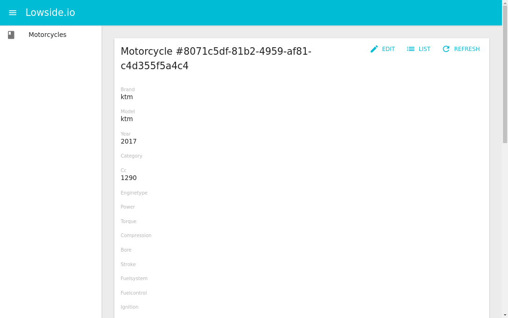

# admin of lowside.io

Admin interface built with <a href="https://github.com/facebook/react">ReactJS</a> and mainly with <a href="https://github.com/marmelab/admin-on-rest" target="_blank">admin-on-rest</a> library.

 
 
 
 
 

